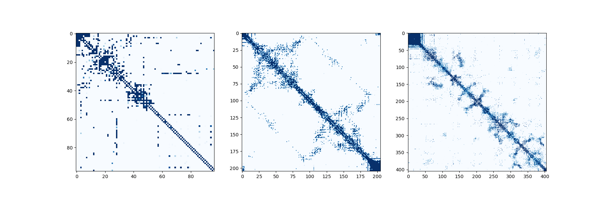

# ProteinFold

```
A toolkit for protein folding inference, designed for MSA transformer models trained with Megatron-LM.
```


## Setup
Pytorch is requried to run inference, please make sure you have [PyTorch](https://pytorch.org/) installed on your device.


## Usage
The toolkit is user-friendly is easy to use.
All you need to do is import the `Inference` module and load the model file. Then you can make inferences on multiple sequece alignments!

### Data format
Please note that the input file should be in `a2m` format.
```
> description-1
Alignment sequence-1
> description-2
Alignment sequence-2
> description-3
Alignment sequence-3
```

### Inference
```python
import torch
from fold.inference import Inference

# load the model
model = Inference('./data/megatron-1b.pt')

# provide your data
msa_data = provide_the_data()

# get the results
row_attention_maps, contacts = model(msa_data, require_contacts=True)
```

Explanation on the outputs:
- `row_attention_maps` is a list of row attention maps from all axial-transformer layers.
- `contacts` is the contact map predicted by the model (or None if `require_contacts` is set to False).


## Example
There are three contact maps generate by Megatron-MSA (1B).


